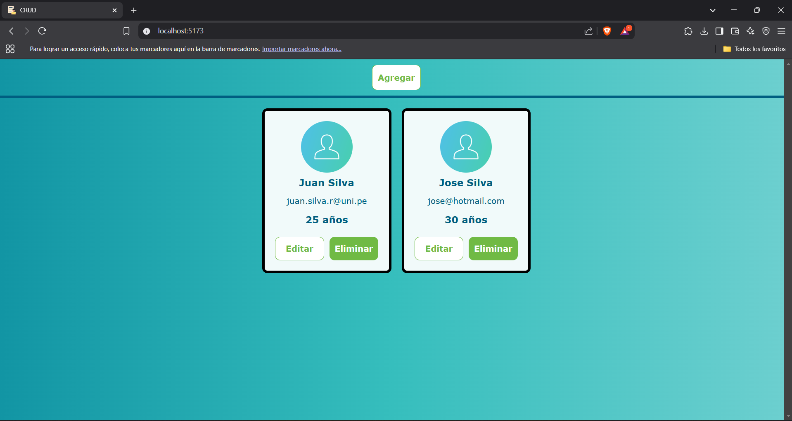
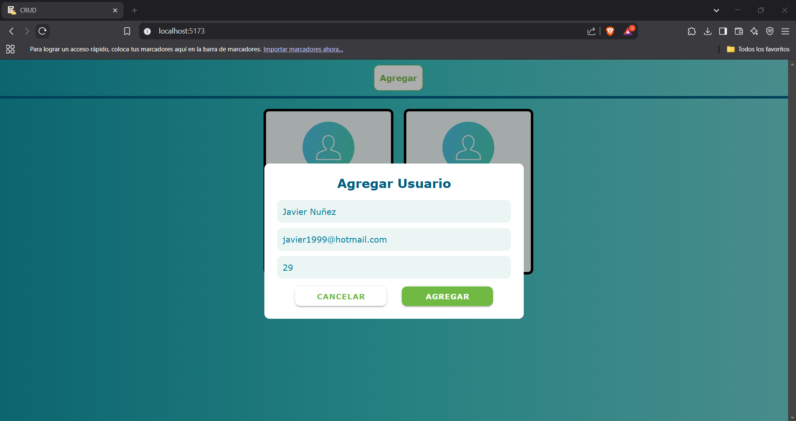
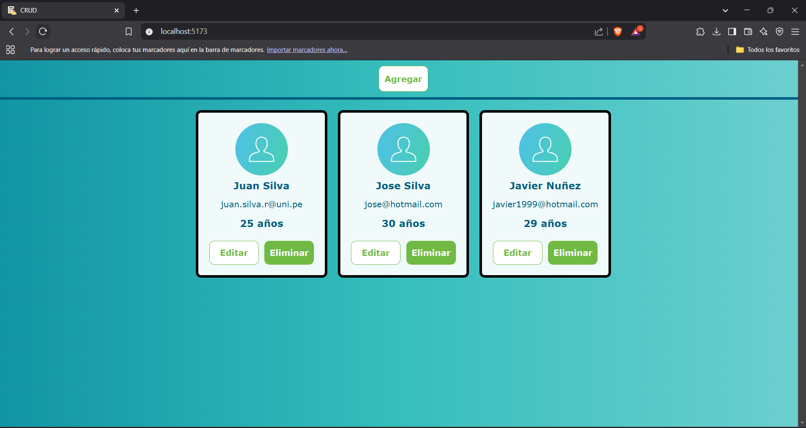
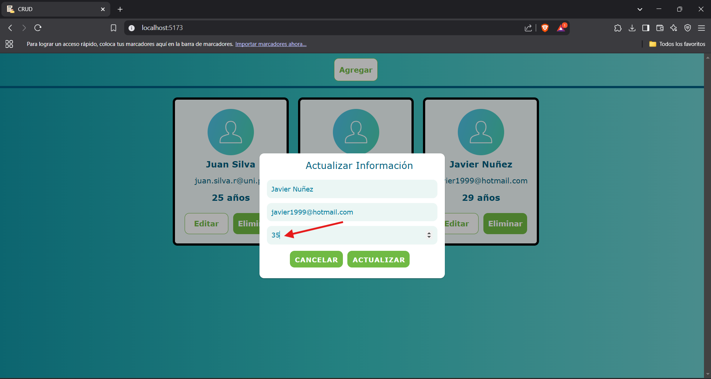
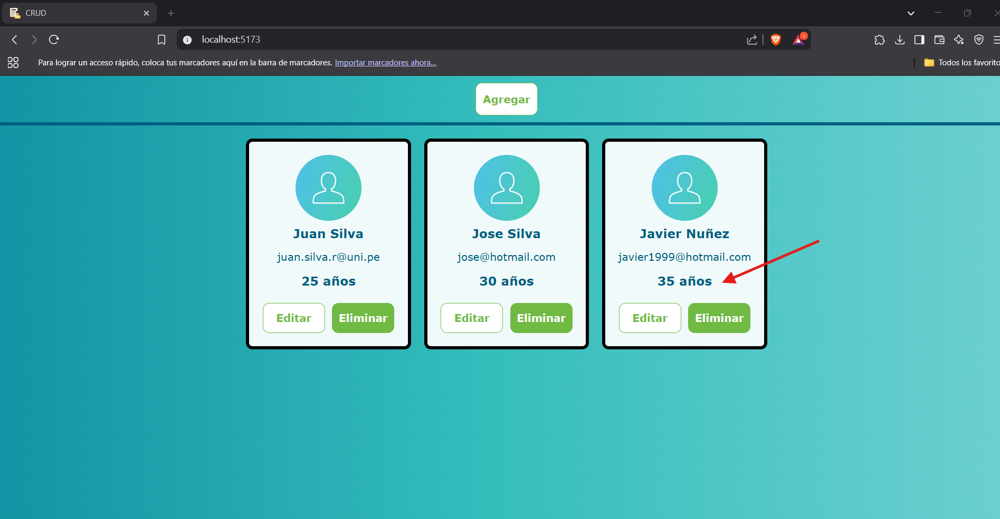

# CRUD  
El siguiente proyecto implemeta un crud básico usando las siguientes tecnologías: 
  
### Frontend:  
- Vue 
  
### Backend:  
- Node + Express  
- Sequelize (usando una base de datos mysql)  
- Zod (para la validación de los datos)  
  
    
### Muestra:  
  
  
 
  
  
  

## Configuración del archivo `.env`
Luego de clonar el repositorio debes hacer lo siguiente:  

En el directorio `backend`, crea un archivo `.env` con el siguiente contenido, ajustando el nombre de la base de datos (`database_nombre`) si es necesario:

```properties
DB_NAME=database_nombre
DB_USER=root
DB_PASSWORD=tu_contraseña
DB_HOST=localhost
DB_DIALECT=mysql  
```

## Creación de la Base de Datos  
```sql
CREATE DATABASE IF NOT EXISTS database_nombre;
USE database_nombre;
```  
  
## Correr el proyecto  
  
- Instalar las dependencias usadas en el backend:  

```bash
    npm install
```  
  
- Correr el backend:  
  
```
    npm run dev
```  
  
- Instalar las dependencias usadas en el fronted:  

```bash
    npm install
```  
  
- Correr el frontend:  
  
```
    npm run dev
```

